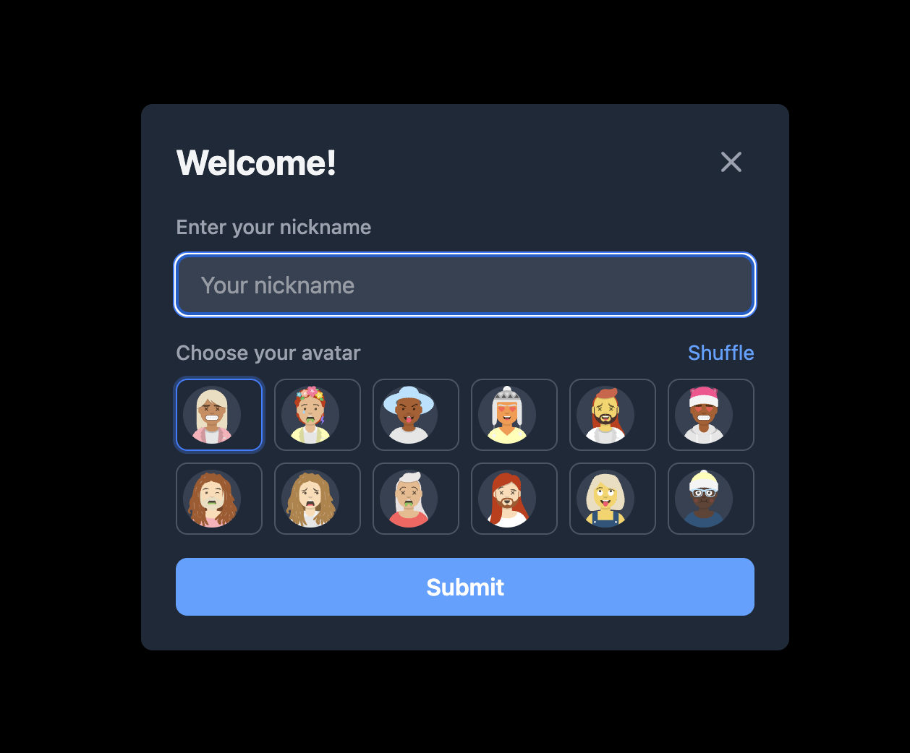
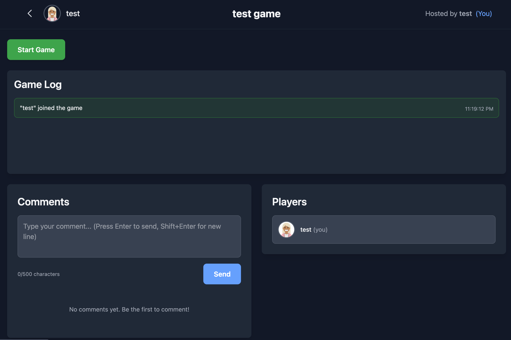
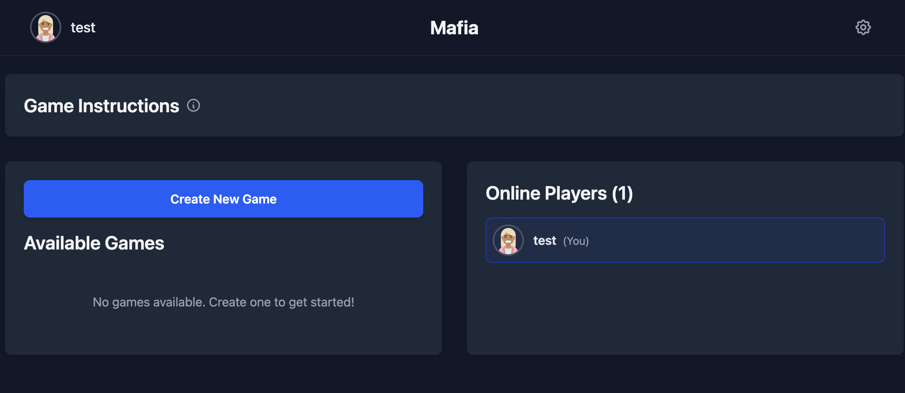

# Mafia

A real-time multiplayer Mafia game with a React frontend and Node.js/Express backend, using Socket.IO for live game state and WebSocket communication.

---

## Screenshots

| Screenshot 1                                    | Screenshot 2                                    | Screenshot 3                                    |
| ----------------------------------------------- | ----------------------------------------------- | ----------------------------------------------- |
|  |  |  |

---

## Project structure

This is a **pnpm workspace** with two packages:

| Package      | Path                                  | Description                                          |
| ------------ | ------------------------------------- | ---------------------------------------------------- |
| **Backend**  | [`mafia-backend/`](./mafia-backend)   | Node.js/Express API + Socket.IO game server          |
| **Frontend** | [`mafia-frontend/`](./mafia-frontend) | React + Vite SPA (lobby, game UI, real-time updates) |

---

## How to run the project

### Prerequisites

- **Node.js** (v18+ recommended)
- **pnpm** (e.g. `npm install -g pnpm`)

### Install dependencies

From the repo root:

```bash
pnpm install
```

This installs dependencies for the workspace and both packages.

### Run in development

**Full stack (backend + frontend):**

```bash
pnpm dev
```

Runs the backend and frontend together. Backend is typically at `http://localhost:3000`, frontend at the URL shown in the terminal (e.g. `http://localhost:5173`).

**Backend only:**

```bash
pnpm dev:backend
```

**Frontend only:**

```bash
pnpm dev:frontend
```

### Build for production

```bash
pnpm build
```

Builds both backend and frontend. To run the backend after building:

```bash
cd mafia-backend && pnpm start
```

Serve the frontend build (e.g. from `mafia-frontend/dist`) with any static file server.

### Other scripts

- `pnpm lint` — Lint backend and frontend
- `pnpm build:backend` — Build only backend
- `pnpm build:frontend` — Build only frontend

---

## Documentation (README files)

| Document                                                                                 | Description                                                                                                                                |
| ---------------------------------------------------------------------------------------- | ------------------------------------------------------------------------------------------------------------------------------------------ |
| [**mafia-frontend/README.md**](./mafia-frontend/README.md)                               | Frontend app: stack (React, Vite, TanStack Router, Tailwind), structure, pages (Lobby, Game), hooks, env vars, Socket.IO events, Storybook |
| [**mafia-backend/README.md**](./mafia-backend/README.md)                                 | Backend service: stack (Express, Socket.IO), architecture, API and Socket events, game rules, how to run                                   |
| [**mafia-backend/src/socket/README.md**](./mafia-backend/src/socket/README.md)           | Socket handlers: `gameSocket.ts`, events handled/emitted, room management                                                                  |
| [**mafia-backend/src/services/README.md**](./mafia-backend/src/services/README.md)       | Core services: GameManager, ConnectionManager, NicknameManager and their methods                                                           |
| [**mafia-backend/src/routes/README.md**](./mafia-backend/src/routes/README.md)           | HTTP routes: game and user REST endpoints, auth, integration                                                                               |
| [**mafia-backend/src/middlewares/README.md**](./mafia-backend/src/middlewares/README.md) | Middlewares: user identity via `mafia_user_id` cookie                                                                                      |
| [**mafia-backend/src/jobs/README.md**](./mafia-backend/src/jobs/README.md)               | Background jobs: game cleanup cron (inactive games)                                                                                        |

---

## Conclusion

This project is a full-stack **real-time Mafia game**: players join a lobby, create or join games, and play through day/night phases with voting, roles (Mafia, Doctor, Villagers), and live updates. The backend keeps game state in memory, manages Socket.IO rooms and REST APIs, and runs a daily cleanup job. The frontend provides the lobby and game UI with WebSocket subscriptions, TanStack Query, and optional i18n and Storybook. Everything is TypeScript, with a single repo and pnpm workspace for straightforward install and run (`pnpm install` then `pnpm dev`).
