# Mafia Game Sequence Diagram

```mermaid
sequenceDiagram
    participant Host
    participant Player1
    participant Player2
    participant PlayerN
    participant Client
    participant Socket
    participant GameManager
    participant GameSocketHandler

    Note over Host,GameSocketHandler: Phase 1: Game Setup
    
    Host->>Socket: game:create({name, maxPlayers})
    Socket->>GameManager: createGame(hostId, request)
    GameManager-->>GameManager: Validate & create game
    GameManager-->>Socket: game (status: 'waiting')
    Socket->>Socket: Join game room
    Socket->>Host: game:created event
    Socket->>Host: game:logs:all (join log)
    
    Player1->>Socket: game:join({gameId})
    Socket->>GameManager: joinGame(gameId, userId)
    GameManager-->>GameManager: Validate & add player
    GameManager-->>Socket: {success, game, log}
    Socket->>Socket: Join game room
    Socket->>Player1: game:updated event
    Socket->>Game Room: game:log (player joined)
    
    Player2->>Socket: game:join({gameId})
    Socket->>GameManager: joinGame(gameId, userId)
    Note over GameManager: ... (more players join) ...
    
    Note over Host,GameSocketHandler: Phase 2: Game Start
    
    Host->>Socket: game:start({gameId})
    Socket->>GameManager: startGame(gameId, hostId, callback)
    GameManager->>GameManager: Assign roles (mafia, doctor, villager)
    GameManager->>GameManager: Set status: 'in-progress'
    GameManager->>GameManager: Set phase: 'day', dayNumber: 1
    GameManager->>GameManager: Set phaseEndTime (20s)
    GameManager->>GameManager: Schedule transitionPhase()
    GameManager-->>Socket: {success, game, logs}
    Socket->>Game Room: game:updated (roles assigned)
    Socket->>Game Room: game:log (game started)
    Socket->>Game Room: game:log (Day 1 begins)
    
    Note over Host,GameSocketHandler: Phase 3: Day Phase - Discussion & Voting
    
    loop Day Phase (20 seconds)
        Player1->>Socket: game:comment:send({gameId, message})
        Socket->>GameManager: addComment(gameId, userId, message)
        GameManager-->>Socket: {success, comment}
        Socket->>Game Room: game:comment (broadcast)
        
        Player2->>Socket: game:vote({gameId, targetUserId})
        Socket->>GameManager: voteDay(gameId, userId, targetUserId)
        GameManager-->>GameManager: Update dayVotes array
        GameManager-->>Socket: {success, game}
        Socket->>Game Room: game:updated (vote recorded)
        
        Note over PlayerN: Other players vote/comment...
    end
    
    Note over GameManager: phaseEndTime reached (20s)
    GameManager->>GameManager: transitionPhase()
    GameManager->>GameManager: processDayVotes()
    GameManager->>GameManager: Count votes, find most voted
    alt Lynched player found
        GameManager->>GameManager: Set player.alive = false
        GameManager->>GameManager: Create lynch log
    else No lynch
        GameManager->>GameManager: Create "no lynch" log
    end
    GameManager->>GameManager: checkWinConditions()
    alt Game finished (win condition met)
        GameManager->>GameManager: Set status: 'finished', winner
        GameManager->>GameSocketHandler: onPhaseTransition(game)
        GameSocketHandler->>Game Room: game:updated (game finished)
        GameSocketHandler->>Game Room: game:log (winner announced)
        Note over Host,GameSocketHandler: Game Ends
    else Game continues
        GameManager->>GameManager: completeDayToNightTransition()
        GameManager->>GameManager: Set phase: 'night', clear dayVotes
        GameManager->>GameManager: Schedule next transitionPhase() (20s)
        GameManager->>GameSocketHandler: onPhaseTransition(game)
        GameSocketHandler->>Game Room: game:updated (night phase)
        GameSocketHandler->>Game Room: game:log (Night N begins)
    end
    
    Note over Host,GameSocketHandler: Phase 4: Night Phase - Mafia Kill & Doctor Heal
    
    loop Night Phase (20 seconds)
        Note over Player1: If role = 'mafia'
        Player1->>Socket: game:vote({gameId, targetUserId})
        Socket->>GameManager: voteNight(gameId, userId, targetUserId)
        GameManager-->>GameManager: Update nightVotes array
        GameManager-->>Socket: {success, game}
        Socket->>Game Room: game:updated (mafia vote recorded)
        
        Note over Player2: If role = 'doctor'
        Player2->>Socket: game:vote({gameId, targetUserId})
        Socket->>GameManager: voteNight(gameId, userId, targetUserId)
        GameManager-->>GameManager: Set doctorHeal = {fromUserId, targetUserId}
        GameManager-->>Socket: {success, game}
        Socket->>Game Room: game:updated (doctor heal recorded)
        
        Note over PlayerN: Villagers cannot vote at night
    end
    
    Note over GameManager: phaseEndTime reached (20s)
    GameManager->>GameManager: transitionPhase()
    GameManager->>GameManager: processNightVotes()
    GameManager->>GameManager: Count mafia votes, find most voted target
    alt Doctor saved the target
        GameManager->>GameManager: Create heal log (target saved)
    else Target killed
        GameManager->>GameManager: Set target.alive = false
        GameManager->>GameManager: Create mafia kill log
    end
    GameManager->>GameManager: checkWinConditions()
    alt Game finished (win condition met)
        GameManager->>GameManager: Set status: 'finished', winner
        GameManager->>GameSocketHandler: onPhaseTransition(game)
        GameSocketHandler->>Game Room: game:updated (game finished)
        GameSocketHandler->>Game Room: game:log (winner announced)
        Note over Host,GameSocketHandler: Game Ends
    else Game continues
        GameManager->>GameManager: completeNightToDayTransition()
        GameManager->>GameManager: Set phase: 'day', dayNumber++, clear nightVotes & doctorHeal
        GameManager->>GameManager: Schedule next transitionPhase() (20s)
        GameManager->>GameSocketHandler: onPhaseTransition(game)
        GameSocketHandler->>Game Room: game:updated (day phase)
        GameSocketHandler->>Game Room: game:log (Day N+1 begins)
        Note over Host,GameSocketHandler: Loop back to Day Phase
    end
    
    Note over Host,GameSocketHandler: Win Conditions Checked Each Phase Transition:
    Note over GameManager: 1. Mafia wins: mafia >= villagers+doctors (full control)
    Note over GameManager: 2. Mafia wins: no doctors + mafia >= villagers (numerical parity)
    Note over GameManager: 3. Mafia wins: transitioning to night + no doctors + mafia >= villagers-1
    Note over GameManager: 4. Villagers win: all mafia eliminated (mafia === 0)
```

## Key Game Mechanics

### Roles
- **Mafia**: Vote during night to kill a player
- **Doctor**: Vote during night to heal a player (can save from mafia kill)
- **Villager**: Vote during day to lynch a suspected mafia

### Phase Flow
1. **Day Phase** (20 seconds): All alive players discuss and vote to lynch
2. **Night Phase** (20 seconds): Mafia votes to kill, Doctor votes to heal
3. **Automatic Transition**: After 20 seconds, votes are processed and phase transitions
4. **Win Check**: After each phase transition, win conditions are checked

### Win Conditions
- **Villagers Win**: All mafia are eliminated
- **Mafia Wins**: Mafia controls majority (mafia >= others)
- **Mafia Wins**: No doctors left + mafia >= villagers
- **Mafia Wins**: Transitioning to night with no doctors + inevitable kill gives mafia control

### Voting
- **Day Votes**: All alive players can vote (stored in `dayVotes` array)
- **Night Votes**: Only mafia can vote to kill (stored in `nightVotes` array)
- **Doctor Heal**: Only doctor can vote to heal (stored in `doctorHeal` field)
- Votes are counted by majority (player with most votes is selected)
